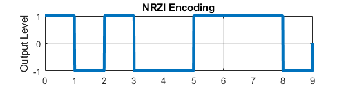
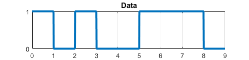
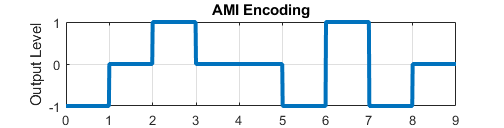
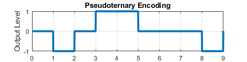
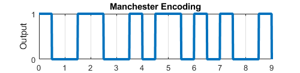
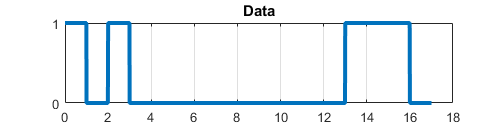

# Tapir Lab.'s Line Coding Example

## Description

TBC

## Nonreturn to Zero Inverted Encoding
TBC

 

## Bipolar-AMI Encoding
TBC

 
## Pseudoternary Encoding
TBC

 
## Nonreturn to Zero-Level Encoding
TBC

  

## Manchester Encoding
TBC

 
## Differential Manchester Encoding
TBC

 
## B8ZS Encoding
TBC

 
